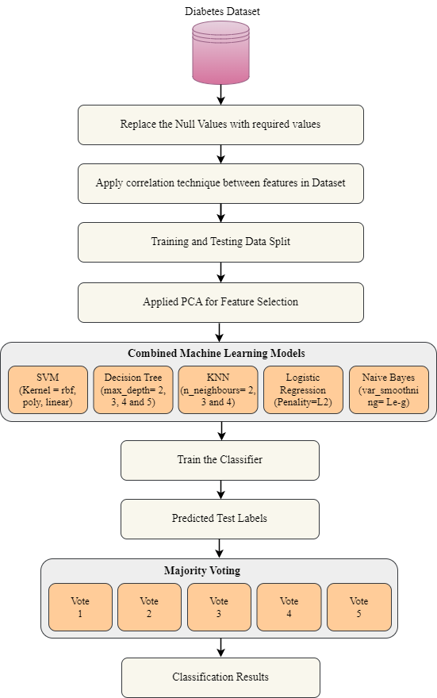
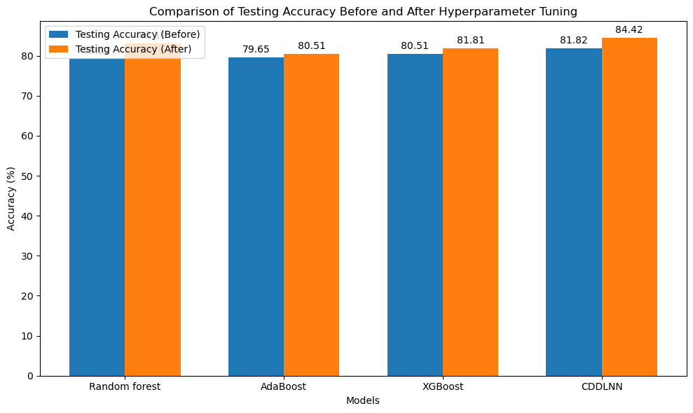

# Design and Implementation of a Diabetic Disease Identification Algorithm Based on Data Mining - Analysis

## Overview

This repository contains the code for the data mining and modeling process aimed at predicting diabetes using various classifier models. The analysis is conducted in the 'diabeties.ipynb' Jupyter Lab.

## Data Mining and Modeling

In this investigative study, we focused on the Diabetes dataset, characterized by multiple variables. Our innovative approach involves the introduction of a Comprehensive Deep Dense Layer Neural Network (CDDLNN). This model seamlessly integrates classical machine learning (ML) techniques and ensemble learning algorithms to enhance the precision of diabetes disease prediction. A meticulous comparative analysis was conducted, pitting the CDDLNN against combined and ensemble learning models to discern which configuration yields optimal results.

## Combined Classical Learning Model Performance

| Metric                  | Value   |
|-------------------------|---------|
| Model                   | Combined classical learning model (DT, LR, KNN, SVM, and NB ensemble) (in %) |
| Testing accuracy        | 81.81   |
| Validation accuracy     | 84.46   |
| Precision               | 77.27   |
| Recall                  | 65.38   |
| Specificity             | 90.19   |
| MCC (Matthews Correlation Coefficient) | 58.18   |

These performance metrics demonstrate the effectiveness of the combined classical learning model in predicting outcomes.

## Performance Evaluation Values (Before Hyperparameter Tuning)

| Model        | Random Forest | AdaBoost | XGBoost | CDDLNN  |
|--------------|---------------|----------|---------|---------|
| Testing accuracy   | 79.22 | 79.65 | 80.51 | 81.82   |
| Validation accuracy | 81.16 | 80.16 | 82.71 | 87.92   |
| Precision   | 70.83 | 73.08 | 72.00 | 83.33   |
| Recall      | 68.00 | 73.08 | 69.23 | 57.69   |
| Specificity | 86.27 | 86.27 | 86.27 | 94.12   |
| MCC         | 52.74 | 54.49 | 56.05 | 60.20   |

## Performance Evaluation Values (After Hyperparameter Tuning)

| Model        | Random Forest | AdaBoost | XGBoost | CDDLNN  |
|--------------|---------------|----------|---------|---------|
| Testing accuracy   | 83.11 | 80.51 | 81.81 | 84.42   |
| Validation accuracy | 83.61 | 82.60 | 84.06 | 91.01   |
| Precision   | 78.26 | 75.00 | 73.08 | 85.12   |
| Recall      | 69.23 | 69.23 | 73.08 | 65.39   |
| Specificity | 90.20 | 88.24 | 86.28 | 94.12   |
| MCC         | 53.97 | 56.05 | 59.35 | 64.17   |

## Comparative Accuracy of Proposed CDDLNN with Other Models

| Models              | Testing Accuracy (%) |
|---------------------|----------------------|
| Random Forest       | 83.11                |
| AdaBoost            | 80.51                |
| XGBoost             | 81.81                |
| Combined            | 81.81                |
| Proposed CDDLNN     | 84.42                |

1. **Values of evaluation parameters evaluated for the classical ensemble model:**
   
2. **Comparison of Testing Accuracy Before and After Hyperparameter Tuning:**
   
3. **Comparative accuracy of proposed CDDLNN with other models:**
   

## Diabeties.ipynb

For a detailed analysis and comparison of all models, please refer to the 'diabeties.ipynb' file in this directory. The Jupyter Lab provides step-by-step explanations, visualizations, and comparisons of the models used in the diabetes prediction task.

Feel free to explore the notebook and delve into the details of each model's performance.

---

**Note:** If you have any questions or need further clarification, please don't hesitate to reach out.

