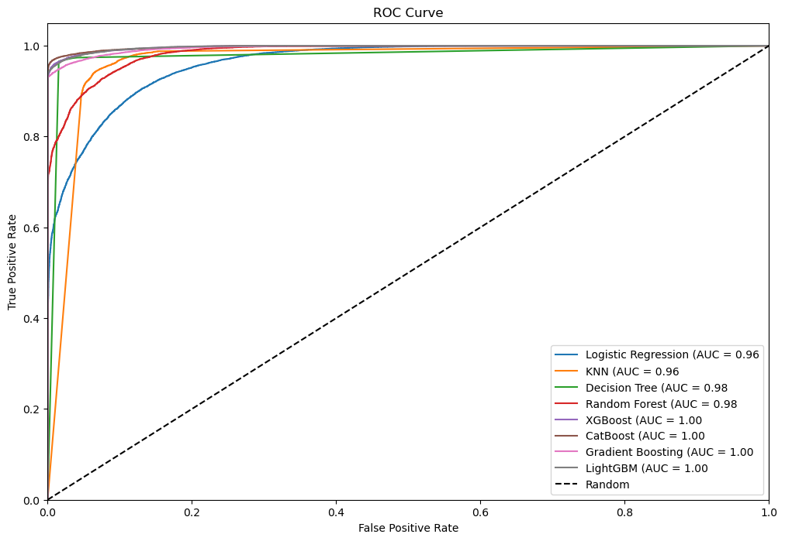
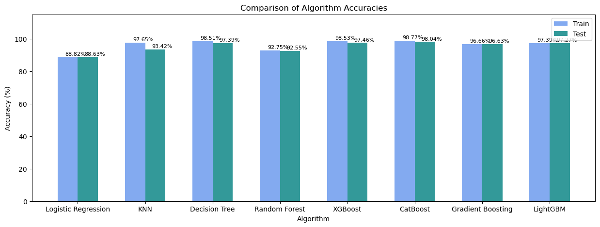

# Design and Implementation of a Diabetic Disease Identification Algorithm Based on Data Mining - Analysis

## Overview

This repository contains the code for the data mining and modeling process aimed at predicting diabetes using various classifier models. The analysis is conducted in the 'diabeties.ipynb' Jupyter Notebook.

## Data Mining and Modeling

In the data mining and modeling process, we explore popular classifier models, including Logistic Regression, KNN, Decision Tree, Random Forest, and Multilayer Perceptron Neural Network. Additionally, we apply advanced models such as XGBoost, CATBoost, Gradient Boosting, and LightGBM. The evaluation is based on performance metrics, including accuracy, precision, recall, and F1-score, to predict diabetes classifications. The goal is to identify the best-performing model for our specific requirements.

## Model Fitting and Prediction

In this section, we present the accuracy and classification report for each machine learning algorithm applied to the Diabetic Disease Identification task.

### I. Logistic Regression

- **Accuracy:** 0.89
- **Classification Report:**
  
|           | Precision | Recall | F1-Score | Support |
|-----------|-----------|--------|----------|---------|
| Class 0   | 0.89      | 0.88   | 0.89     | 18293   |
| Class 1   | 0.88      | 0.89   | 0.89     | 18307   |

### II. KNN (K-Nearest Neighbors)

- **Best Parameters:** {'kneighborsclassifier__n_neighbors': 3, 'kneighborsclassifier__weights': 'distance'}
- **Accuracy:** 0.93
- **Classification Report:**
  
|           | Precision | Recall | F1-Score | Support |
|-----------|-----------|--------|----------|---------|
| Class 0   | 0.96      | 0.91   | 0.93     | 18293   |
| Class 1   | 0.91      | 0.96   | 0.94     | 18307   |

### III. Decision Tree

- **Accuracy:** 0.97
- **Classification Report:**
  
|           | Precision | Recall | F1-Score | Support |
|-----------|-----------|--------|----------|---------|
| Class 0   | 0.97      | 0.98   | 0.97     | 18293   |
| Class 1   | 0.98      | 0.97   | 0.97     | 18307   |

### IV. Random Forest Classifier

- **Accuracy:** 0.93
- **Classification Report:**
  
|           | Precision | Recall | F1-Score | Support |
|-----------|-----------|--------|----------|---------|
| Class 0   | 0.93      | 0.92   | 0.92     | 18293   |
| Class 1   | 0.92      | 0.93   | 0.93     | 18307   |

### V. XGBoost Classifier

- **Accuracy:** 0.97
- **Classification Report:**

|           | Precision | Recall | F1-Score | Support |
|-----------|-----------|--------|----------|---------|
| Class 0   | 0.96      | 0.99   | 0.97     | 18293   |
| Class 1   | 0.99      | 0.96   | 0.97     | 18307   |

### VI. Catboost Classifier

- **Accuracy:** 0.98
- **Classification Report:**

|           | Precision | Recall | F1-Score | Support |
|-----------|-----------|--------|----------|---------|
| Class 0   | 0.97      | 0.99   | 0.98     | 18293   |
| Class 1   | 0.99      | 0.97   | 0.98     | 18307   |

### VII. Gradient Boost Classifier

- **Accuracy:** 0.97
- **Classification Report:**
  
|           | Precision | Recall | F1-Score | Support |
|-----------|-----------|--------|----------|---------|
| Class 0   | 0.95      | 0.99   | 0.97     | 18293   |
| Class 1   | 0.99      | 0.95   | 0.97     | 18307   |

### VIII. LGBM Classifier

- **Accuracy:** 0.97
- **Classification Report:**
  
|           | Precision | Recall | F1-Score | Support |
|-----------|-----------|--------|----------|---------|
| Class 0   | 0.95      | 0.99   | 0.97     | 18293   |
| Class 1   | 0.99      | 0.95   | 0.97     | 18307   |

### Model Comparison Table

| Algorithm               | Accuracy | Precision | Recall | F1-Score | Support |
|-------------------------|----------|-----------|--------|----------|---------|
| Logistic Regression     | 0.89     | 0.89      | 0.89   | 0.89     | 36600   |
| KNN                     | 0.93     | 0.93      | 0.93   | 0.93     | 36600   |
| Decision Tree           | 0.97     | 0.97      | 0.97   | 0.97     | 36600   |
| Random Forest           | 0.93     | 0.93      | 0.93   | 0.93     | 36600   |
| XGBoost                 | 0.97     | 0.97      | 0.97   | 0.97     | 36600   |
| Catboost                | 0.98     | 0.98      | 0.98   | 0.98     | 36600   |
| Gradient Boosting       | 0.97     | 0.97      | 0.97   | 0.97     | 36600   |
| LGBM                    | 0.97     | 0.97      | 0.97   | 0.97     | 36600   |

These results provide an overview of the performance of each algorithm in identifying diabetic disease. Feel free to explore further details in the corresponding Jupyter Notebook.

## Model Evaluation

All models have shown excellent performance, achieving accuracy scores ranging from 0.89 to 0.98. The AUC scores indicate strong performance, with values close to 1.0. Choosing the best model depends on specific project requirements. However, based on the analysis, CatBoost stands out with the highest accuracy (0.98) and AUC (1.00). CatBoost is known for its robust handling of categorical features and consistently strong out-of-the-box performance.

In addition to the high accuracy and AUC scores, visual representations further illustrate the model performance. The following images provide insights into the model evaluation:

1. **AUC Report:**
   
   
2. **Accuracy Values:**
   

## Diabeties.ipynb

For a detailed analysis and comparison of all models, please refer to the 'diabeties.ipynb' file in this directory. The Jupyter Notebook provides step-by-step explanations, visualizations, and comparisons of the models used in the diabetes prediction task.

Feel free to explore the notebook and delve into the details of each model's performance.

---

**Note:** If you have any questions or need further clarification, please don't hesitate to reach out.

